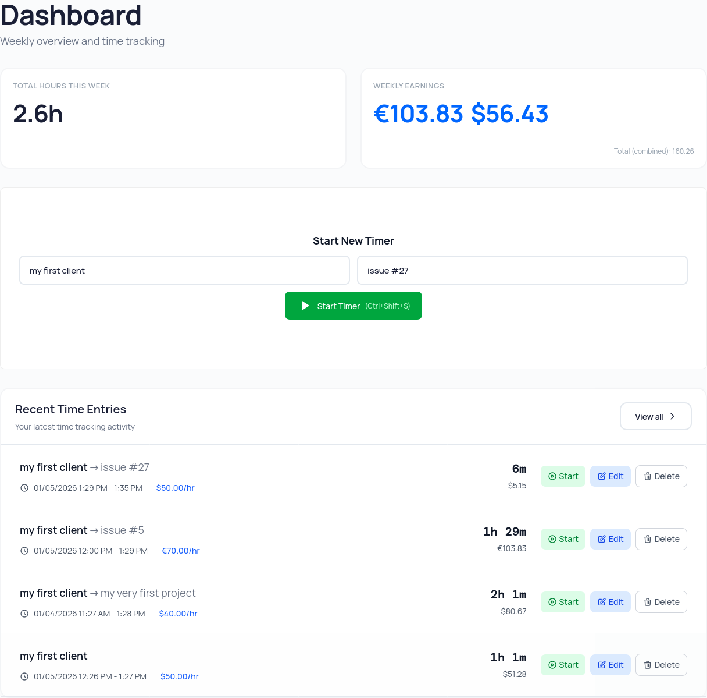
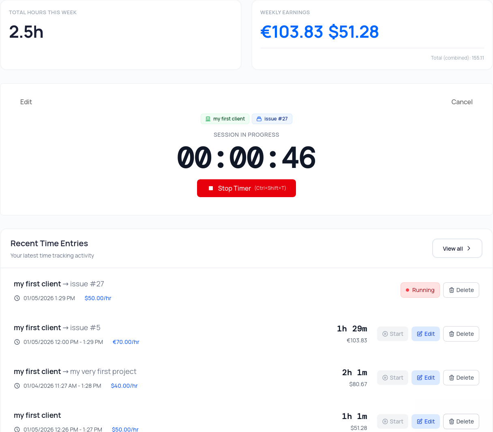
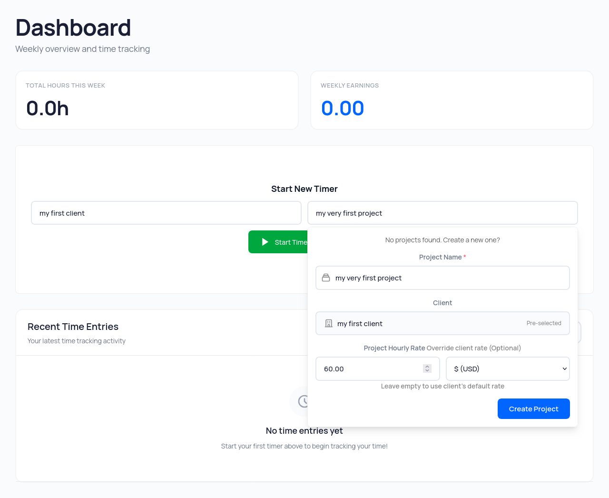
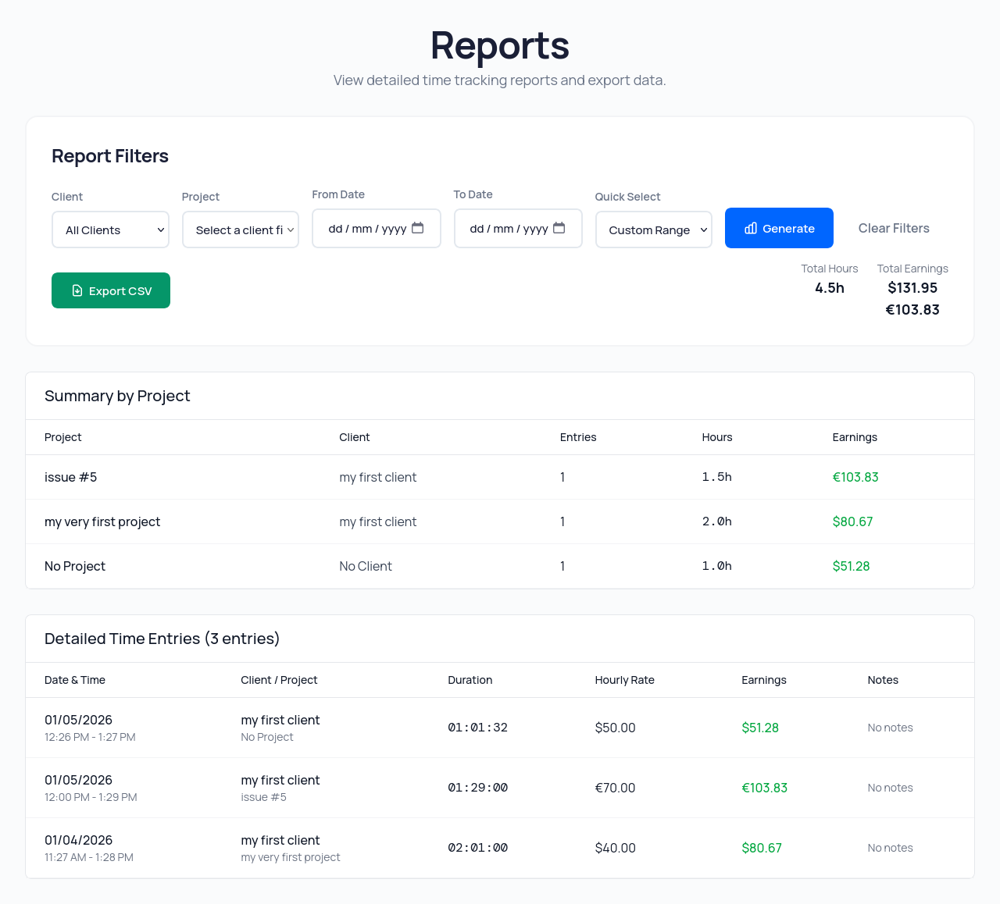

# SimpleTimer OS

**SimpleTimer — a simple time tracking web app. Don't spend time tracking time.**

Timer • Clients • Projects • Reports

A simple time tracking web app for freelancers and consultants who bill by the hour. Self-host forever. Built with Laravel 12 and Hotwire. [O'Saasy licensed](https://osaasy.dev/)—free to self-host forever, SaaS rights reserved.



## Why SimpleTimer OS?

Most time trackers overwhelm you with 100+ features you'll never use. SimpleTime OS is a simple web app that gives you exactly what you need—timer, clients, projects, reports—nothing more.

**Own your data. Pay nothing. Forever.**

## Sound Familiar?

**Paying $15/month for features you never use?**
**Spending more time starting timers than actually working?**
**Worried about privacy and who sees your data?**

** SimpleTimer gives you exactly what you need—nothing more, nothing less.**

## Why Self-Host Your Time Tracker?

Self-hosting isn't just about saving money—it's about control, privacy, and freedom from vendor lock-in.

| Traditional SaaS Trackers | SimpleTime OS (Self-Hosted) |
|---------------------------|------------------------------|
| ✗ Recurring subscriptions forever | ✓ **$0 forever** |
| ✗ 100+ features built for teams, forced on solo users | ✓ **4 core features**: Timer, Clients, Projects, Reports |
| ✗ Vendor servers (your data, their rules) | ✓ **Your server** (complete data ownership & privacy) |
| ✗ Feature gates, upgrade prompts, artificial limits | ✓ **No limits**, no upsells, no vendor pressure |
| ✗ Closed source (black box you can't inspect) | ✓ **Open source** (audit every line, customize freely) |
| ✗ Vendor lock-in (data export headaches) | ✓ **Full control** (your database, your rules) |

**Self-hosting gives you complete control without ongoing costs**

## Built for Solo Developers

SimpleTime OS is a simple web app designed for one person—fast, straightforward, zero overhead. Track billable hours for clients without the complexity of team collaboration tools.

**Good fit if you:**
- Bill by the hour and need simple timer tracking
- Want to self-host and own your data forever
- Value clean, auditable Laravel codebases
- Don't need project management features or team collaboration

**Not for you if:**
- You need multi-user support or enterprise features
- You prefer managed SaaS over self-hosting

## Features

### Dead Simple Tracking
**Track billable hours 10x faster. Click. Done. No forms, no friction, no BS.**

- ✓ One-click start/stop
- ✓ Keyboard shortcuts (Ctrl+Shift+S)
- ✓ Survives page refreshes
- ✓ Only one timer at a time



### Client & Project Management
**From £75/hr London projects to $100/hr NYC clients—track it all. Multi-currency built in.**

- ✓ Create clients/projects inline
- ✓ Set hourly rates (56 currencies)
- ✓ Project rates override client rates
- ✓ No setup ceremony required



### Reports That Pay You
**Generate clean reports in seconds. Export to CSV, attach to invoice, get paid.**

- ✓ Filter by date, client, project
- ✓ CSV export for invoicing
- ✓ Total hours + earnings per project
- ✓ Clean format for clients



## Tech Stack

**Backend:** Laravel 12, PHP 8.4, SQLite/MySQL/PostgreSQL
**Frontend:** Hotwire Turbo, Stimulus, Tailwind + DaisyUI, Importmap
**Testing/QA:** PHPUnit, Pint, Larastan, Rector

Hotwire means SPA-like UX without heavy JS. Importmap means no build step for JavaScript.

## How Hard Is Self-Hosting?

**Easier than you think. Here's what you need:**

- **Works on:** DigitalOcean ($5/mo), Vultr, Linode, your laptop
- **Install time:** 15 minutes
- **Requirements:** PHP 8.4, Git (that's it)
- **Managed option:** Laravel Forge ($12/mo handles everything)

**Not technical?** Forge auto-deploys. You just click buttons. No command line required.

## Installation

**Ready in 5 Minutes**

If you can clone a Git repo, you can install SimpleTime OS.

Requires PHP 8.4+

```bash
git clone <repository-url>
cd simple
./install.sh
php artisan app:create-user
php artisan serve
```

**Done. You're tracking time.**

Manual install steps in `install.sh` if you prefer to do it yourself.

### Hosting Options
- **$0/month**: Your laptop or home server
- **$5/month**: DigitalOcean, Linode, Vultr
- **$12/month**: Laravel Forge (managed deployment)

All options give you full data ownership. No vendor lock-in.

## Common Commands

```bash
# User management
php artisan app:create-user
php artisan user:reset-password user@email.com

# Development
php artisan serve
php artisan migrate
php artisan optimize:clear  # Clear all caches when things break
```

## Single User Setup

App is designed for one user. Registration is disabled after first user is created.

Create account after install:
```bash
php artisan app:create-user
```

Reset password if needed:
```bash
php artisan user:reset-password your-email@example.com
```

Need a second user for testing? Use `php artisan app:create-user --force`

## Usage

Start timer from dashboard - pick client/project, hit play or `Ctrl+Shift+S`. Create clients inline while starting a timer.

Reports page lets you filter and export to CSV. Set your preferred date/time formats in Settings.

## Configuration

Main settings in `.env`:
```env
DB_CONNECTION=sqlite
APP_TIMEZONE=UTC  # Set to your timezone
```

User preferences (date/time formats, hourly rates) configurable in Settings page.

## O'Saasy License

**[Learn more about O'Saasy License →](https://osaasy.dev/)**

**Free to self-host forever. SaaS rights reserved.**

The O'Saasy License means:
- ✓ **Use it freely**: Install, modify, and run SimpleTime OS on your own server at no cost
- ✓ **Own your data**: Full control and privacy—your data never leaves your server
- ✓ **Audit the code**: Open source, inspect every line
- ✓ **Extend it**: Build custom features for your own needs
- ✗ **No SaaS competition**: You cannot offer SimpleTime OS as a competing hosted service

**Why this license?** It keeps the project sustainable while ensuring you can self-host forever without restrictions.

Full license text: [LICENSE](LICENSE)

## Contributing

PRs welcome. Standard fork → branch → PR workflow.

If you're good with UI/UX and want to help make it more minimal/clean, that'd be great.

## License

[O'Saasy licensed](https://osaasy.dev/) - free to self-host forever, SaaS rights reserved.

See the [O'Saasy License](#osaasy-license) section above for details.

## FAQ

**Here's what freelancers usually ask:**

### Is it really free forever?
Yes. O'Saasy license means free self-hosting forever. We reserve rights to offer a managed SaaS version, but the open-source stays free.

### Can I migrate from Toggl/Harvest?
CSV import coming soon. Manual entry works today.

### What if I break it?
Support via GitHub issues. Active community. Common fixes in README.

### How often should I backup?
Daily recommended. Simple SQLite file copy. Takes 5 seconds.

## Support

Open an issue if something breaks. Common fixes:
- Forgot password: `php artisan user:reset-password your-email@example.com`
- App errors: `php artisan optimize:clear`

## Roadmap

### Available Today

Everything you need to track time and get paid. No waiting.

- **Timer + Shortcuts**: One-click tracking with Ctrl+Shift+S/T
- **Multi-Currency**: 56 currencies, client & project rates
- **CSV Exports**: Reports ready for invoicing
- **Client Management**: Organize projects & clients inline

### Coming Soon

We're building features that expand SimpleTime OS while maintaining our core philosophy of simplicity.

#### API & Webhooks
Programmatic access to your time tracking data. Integrate SimpleTime OS with your existing tools and workflows.

- RESTful API endpoints for all resources
- Webhook notifications for timer events
- Token-based authentication
- Integrate with invoicing, project management, and more

**Perfect for:** Developers who want to automate workflows and connect SimpleTime OS to their existing tools.

#### SaaS Hosted Version
Don't want to self-host? We'll handle all the technical details for you. Same simplicity, zero server management.

- Fully managed hosting - we handle everything
- Automatic updates and security patches
- Daily backups included
- Start tracking in under 60 seconds

**Perfect for:** Freelancers and consultants who want simplicity without the technical setup.

---

Core stays free and open source. Optional paid features will support development, but the base app will always be O'Saasy licensed and self-hostable.

**Interested in these features?** Star on [GitHub](https://github.com/jcergolj/simpletime-os) to stay updated.
